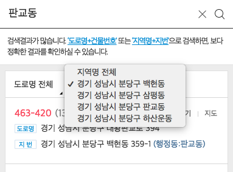

# Daum 우편번호 서비스

[Daum 우편번호 서비스](http://postcode.map.daum.net/guide)는 웹사이트에서 도로명 주소와 우편번호를 검색할 수 있는 **Javascript API**입니다.  
Sample 코드와 상세 Reference는 [http://postcode.map.daum.net/guide](http://postcode.map.daum.net/guide) 에서 확인할 수 있습니다.  

문의 사항은 먼저 아래 FAQ를 확인해주시고, [Issue로 등록해주시면 됩니다.](https://github.com/daumPostcode/QnA/issues)

---

## 자주 묻는 질문(FAQ)

###1. 주소가 없습니다 / 검색되지 않습니다.

우선 [행정자치부 도로명주소 검색시스템](http://juso.go.kr)에서 검색이 되는지 확인해 주세요. 만약 행정자치부 도로명주소 검색시스템에서 검색이 되지 않는다면 직접 등록 요청을 하셔야 합니다. 
 
1. 행정자치부 도로명 주소 검색시스템 접속  
2. 상단 메뉴 중 "고객지원" -> "도로명주소 도움센터(Q&A)" 클릭  
3. 게시판에 해당 주소에 대해서 등록 요청 글을 남기시면 됩니다.(로그인 필요)  

위 단계를 통해 해당 주소가 행정자치부 도로명 주소 검색시스템에 등록이 되면, Daum 우편번호 서비스 시스템에는 등록된 날로부터 1일 후에 업데이트 됩니다.  
만약 행자부 도로명 주소 검색시스템에서는 검색이 되는데 Daum 우편번호 서비스에서 검색이 되지 않는다면, 검색 방식의 차이로 인한 오류일 수 있으니 [Issue로 등록해주시기 바랍니다](https://github.com/daumPostcode/QnA/issues).

###2. 주소에 있는 건물명이 실제 명칭과 다릅니다. 
1번 질문과 같은 방식으로 확인하시면 됩니다. 주소 데이터는 저희가 수정할 수는 없습니다.

###3. 6자리 구우편번호가 필요합니다 
2015년 8월 1일 부로 6자리 구우편번호는 우정사업본부에서 더이상 생성/관리되지 않으므로 5자리 새우편번호(기초구역번호)를 이용하셔야 합니다.  (참고. [우정국 새우편번호 시행 공지](http://www.epost.go.kr/main.retrieveNoticeContent.comm?news_seq_no=900))  현재 일부 제공되고 있는 6자리 구우편번호는 시간이 지남에 따라 삭제될 예정입니다.

###4. REST API로도 제공하고 있나요?
제공 계획은 없습니다.

###5. 정말 아무에게나 무료인가요? 회사에서 상업적인 용도로 써도 무료인가요?
레알 100% 무료입니다.

###6. 하루 사용량 제한이 있나요?
레알 100% 무제한 입니다.

###7. 하단 로고를 안보이게 할 수 없나요?
로고는 정책상 반드시 노출하는 것을 원칙으로 하고 있습니다. 하단의 'Powered by Daum' 을 통한 저작자 표기 정책은 Daum 우편번호서비스를 지속적으로 무료 운영할 수 있는 근거로 활용되고 있으며, 로고를 숨길 경우에는 사용상의 제약을 받을 수 있습니다.

###8. UI를 변경하는 기능이나 옵션은 없나요?
현재 [우편번호 서비스 화면의 색상을 변경할 수 있는 테마기능](http://postcode.map.daum.net/guide#themeWizard)과 '영문보기','지도' 버튼을 가릴 수 있는 옵션을 제공하고 있습니다.
단, 이외 UI컴포넌트 추가 및 레이아웃 변경과 같은 기능은 제공하고 있지 않습니다.

###9. 모바일앱에서도 사용할 수 있나요?
웹뷰를 이용하여 하이브리드앱 제작 방식으로 사용할 수 있습니다. 단, html,js,css들을 정적으로 넣고 실행하는 경우에는 데이터 전달이 되지 않기 때문에, 페이지를 호출하는 방식으로 사용하셔야 합니다.

###10. iOS/Android에서 webview를 이용하여 사용할 수 있나요?
6번과 같이 정적 html,js,css가 아닌 http(s)프로토콜을 사용한 페이지를 호출하는 페이지에서는 사용가능합니다.  
단, 기본 webview의 경우 우편번호서비스의 open메소드를 이용한 팝업방식 보다는 embed메소드를 이용한 레이어 방식을 사용하시길 권해드립니다.  
이유는 기본적인 webview에서 open메소드 사용시, 팝업이 뜨기보다 기존페이지에서 우편번호서비스 페이지로 이동이 되어 버리기 때문에, 데이터 전달이 되지 않습니다. 반드시 open메소드를 사용하시고자 하실때에는 각 플랫폼의 webview에서 window.open에 대응할 수 있도록 webview를 개선하여 사용하시기 바랍니다.

###11. requireJS를 사용할 수 있나요?
아뇨. 현재 대응하고 있지 않습니다.

###12. 팝업창에서 검색 후 결과를 클릭해도 반응이 없습니다.
혹시 웹서버 환경에서 확인하고 계신가요? 정적페이지로 브라우저에서 파일을 오픈하여 사용할 경우에는 host정보를 알 수 없어 데이터 전달이 되지 않습니다.

###13. 팝업창이 비어 있는 채로 뜹니다.
혹시 document.domain을 사용하고 계신가요? Daum 우편번호 서비스를 사용하시는 페이지에서는 document.domain값을 임의로 세팅하는 경우에 일부 IE 브라우저에서 제대로 동작하지 않습니다.

###14. 검색 후 결과 클릭한 후 팝업이 닫히지 않습니다(값이 입력되거나 또는 입력되지 않는 상황).
FAQ 13번의 이슈가 아니라면, javascript 실행시 오류가 난 경우입니다. oncomplete 함수에서 사용하는 변수가 정확한지, input tag의 id값을 잘못 사용하고 있는지 확인해 보시길 바랍니다. 브라우저의 개발자 도구 활용을 권장합니다. (팝업형의 경우 개발자 도구는 팝업창에 focus를 두고 개발자 도구를 띄우셔야 합니다.)
> 예를 들면, document.getElementById() 함수 이용시,   
> IE9이하에서는 input tag의 name값으로도 노드를 가져올 수 있지만, 그 외 브라우저에서는 null을 리턴합니다.   
> 그렇기 때문에 반드시 id 속성을 사용하시기 바라며,   
> 그렇지 못할 경우에 다른 셀렉터 함수(document.querySelector, jQuery selector 등)를 사용하시기 바랍니다.

###15. javascript API 코드를 복사해서 사용해도 되나요?
javascript API 코드를 복사하여 자체 서버에 업로드 하여 사용하실 경우에는 추후에 기능적인 업그레이드로 인한 지원을 받으실 수 없기 때문에 오류가 발생하거나 사용상의 제약을 받을 수 있습니다.

### 16. 사용자가 지번/도로명 중 어떤 것을 선택하더라도 무조건 도로명 주소만 이용하고 싶은데.. 어떻게 해야되나요?
사용자가 선택한 값(userSelectedType)과 상관 없이 로직상 autoRoadAddress변수를 체크하고, 값이 없으면 roadAddress변수를 이용하시면 됩니다.  
도로명 주소의 데이터가 셋팅되는 방법에 대해서 추가 설명 드리자면  
**(autoMapping을 true로 설정한 경우 - 기본값)**  

* 사용자가 지번-도로명 1:N 관계에서 메인 지번주소를 선택할 경우, 도로명 주소는 autoRoadAddress에 들어가게 됩니다. 또한 연관된 도로명 주소를 선택하게 되면 roadAddress에 들어가게 됩니다.
* 사용자가 지번-도로명 1:1 관계에서 메인 지번주소나 연관된 도로명주소를 선택하면, 도로명 주소는 roadAddress에 들어가게 됩니다.
* 사용자가 도로명-지번 1:N, 1:1 관계에서 메인 도로명주소를 선택하거나 연관된 지번주소를 선택할 경우, 도로명 주소는 address, roadAddress에 들어가게 됩니다.

---

## 업데이트 소식

### 2017.01.09
1. **행정동 표시 유무 옵션 추가**
	
    기존의 행정동 표시는 검색어에 반응하여, 검색어가 행정동으로 검색이 됬을 경우에만 표시가 되었습니다.(주소는 무조건 법정동)
    다만, 이 기능을 완화하여 검색어와 상관없이, 검색결과의 주소 중 행정동과 법정동이 서로 다른 경우 무조건 노출하고 이를 데이터로 내릴 수 있도록 변경되었습니다. 
    해당 기능은 showMoreHName이라는 옵션을 통해 활성/비활성 시킬 수 있으며, 기본값은 false입니다.

2. **'읍/면' 정도 데이터화**
	
    이제 '읍/면' 정보도 oncomplete함수의 데이터로 받아보실 수 있습니다.
    추가된 데이터에 따라 bname1/bname2 라는 변수가 추가되었으며 bname2는 기존의 bname과 같고, bname1에 '읍/면' 정보가 들어가게 됩니다. '동'지역의 경우에는 공백입니다. 그래서 bname1의 공백 유무에 따라 적절히 분기하여 사용하시면 됩니다.
    
3. **영문보기/지도 버튼을 가릴 수 있도록 옵션 추가**
	
    기존의 UI변경 기능은 theme기능만 있었으나, 여러 개발환경에 대응할 수 있도록 '영문보기','지도' 버튼을 가릴 수 있는 옵션을 추가 하였습니다. 옵션명은 hideEngBtn/hideMapBtn으로 설정가능하며 기본값은 false입니다.
    다만 해당 옵션의 경우 실제 이용자분들께서 자주 이용하시는 기능이다보니, 웹앱 또는 기타 다른 이유로 인해 window.open이 실행되면 안되는 환경에서만 이용하실 것을 권장합니다.
    
위 모든 추가 기능에 대한 자세한 설명은 저희 [가이드 페이지의 속성 부분](http://postcode.map.daum.net/guide#attributes)을 참고하시기 바랍니다.

### 2016.08.18

1. **문의 방식이 변경되었습니다.**

	블로그 댓글을 이용하여 문의를 받던 불편함을 해소하기 위해, [github issue](https://github.com/daumPostcode/QnA/issues)로 등록하는 방식으로 변경했습니다.  
	github 계정을 만들어야 한다는 불편함이 있긴 하지만, 검색 및 이미지 첨부 기능 등의 장점이 훨씬 크다고 판단했기 때문이에요. 문의에 대한 답변도 메일 알림으로 받을 수 있답니다. 
	
2. **더욱더 정확한 검색을 위한 검색 가이드 문구가 변경되었습니다.**

	우편번호 서비스는 지번 이름으로 검색을 할경우 결과가 매우 많이 나온다는 단점이 있습니다. 그래서 이를 보완하고자 초기화면이나 검색바 안쪽에 가이드 문구를 넣고 있는데요, 다소 설명이 부족한 측면이 있고 개선된 기능이 반영이 안되어 있다는 지적을 받아, 현재 저희 서비스에서 최상의 결과를 얻을 수 있는 4가지 방법에 대해서 설명하는 문구로 변경했습니다.  
	
	해당 기능은 2015년 9월에 추가된 "검색 가이드 강조기능"인 pleaseReadGuide 옵션과 같이 이용하시면, 저희 서비스를 이용하시는 분들께 가이드 문구를 더욱 확실하게 전달 할 수 있습니다.
	
	(건강지킴이님 제안 감사드립니다)
	
3. **우편번호 서비스 v1이 2016년 12월 31일 서비스 종료됩니다**
	
	유지보수의 어려움으로 인해 [2014년 8월에 첫 출시된 v1 서비스](http://postcode.map.daum.net/guide_v1)를 종료하기로 결정하였습니다. 현재 v1서비스는 6자리 구우편번호 DB를 이용하고 있기에 지속적으로 생성/갱신 되는 도로명 주소가 반영되지 않는 구조로, 주소 검색 품질이 점점 떨어지고 있는 상황입니다. (참고. [우정국 새우편번호 시행 공지](http://www.epost.go.kr/main.retrieveNoticeContent.comm?news_seq_no=900))  
	따라서 v1서비스는 2016년 12월 31일까지만 지원할 예정이며, v1서비스를 이용하시는 고객님께서는 최신 버전(v2)으로 변경해 주시기 바랍니다.
([v1 -> v2 이전 가이드 보기](http://postcode.map.daum.net/guide#upgrade|v1))

### 2016.02.23

1. **시군구/도로명 코드가 추가되었습니다.** 

	내려받은 주소를 그룹지어 보여주거나, 저장 후 관리하시기 쉽도록 도로명 주소의 시군구/도로명 코드를 추가하였습니다.
데이터명은 sigunguCode/roadnameCode 로 내려가게 되며, http://postcode.map.daum.net/guide#attributes 페이지의 oncomplete 데이터 항목을 확인해 주세요.

	(신성진님 제안 감사드립니다)

### 2015.11.05

1. **행정동 데이터가 추가되었습니다.** 

	기본적으로 주소는 법정동을 기반으로 검색이 됩니다. 다만 법정/행정동이 다른 주소가 많고, 사용자 편의를 위해 UI상 행정동 정보를 표시하였는데요.
이젠 이 행정동 데이터 또한 내려 받을 수 있습니다.
데이터명은 hname이며, 검색된 주소의 행정동과 법정동이 다른 경우에만 내려가게 됩니다.

	(장동기님, luckpop님 제안 감사드립니다)

### 2015.09

1. **사서함 주소를 검색 할 수 있습니다.** 

	군부대에 편지 보낼때 사서함 많이 쓰시죠?
이제 저희 서비스를 통해 사서함 주소도 검색 할 수 있게 되었습니다.
기본적인 틀은 도로명 주소와 유사하며, 데이터 또한 address와 roadAddress에 들어가게 됩니다.

2. **도로명 주소의 다수 건물명에 대한 UI가 변경되었습니다.** 

	지하철이 있는 건물에 백화점이 같이 있는 경우(ex. 왕산로 214)를 보셨을 거에요. 즉, 주소에는 하나의 도로명주소에 여러개의 건물명이 매핑되어 있을 수 있는데요. 저희 서비스 이용시 주소는 맞는데 자신이 알던 건물이 아니거나 하는 경우가 많아, 하나의 도로명 주소에 여러개의 건물이 있을 경우(행자부 데이터 기준), 각각 개별 선택 할 수 있도록 변경하였습니다.
이렇게 선택할 경우, buildingName, buildingCode 부분이 선택한 주소의 건물명과 건물관리번호가 들어가게 됩니다.

3. **가이드 문구 강조기능이 추가되었습니다.** 

	저희 서비스의 검색 시스템은 도로명 주소의 경우 ‘도로명 + 도로번호’, 지번 주소의 경우 ‘동 + 번지’ 형태로 입력을 해야 최대한 정확한 검색결과를 확인 할 수 있습니다. 그래서 검색어가 모호하거나 결과가 많을 시 항상 가이드 문구를 표시하고 있는데요. 이런 가이드 문구가 잘 보이지 않는다는 제보가 많아, 검색 후 가이드 문구를 강조할 수 있는 기능을 추가하게 되었습니다.
http://postcode.map.daum.net/guide#attributes 의 pleaseReadGuide 부분을 참고해 주세요.

	(건강지킴이님 제안 감사드립니다)

### 2015.07.30

1. **사용자가 선택한 주소가 영문인지를 확인할 수 있습니다.** 

	사용자가 영문주소를 선택해서 클릭한 경우에는 userLanguageType이라는 값에 'E'값이 내려갑니다. 한글일 경우에는 'K'로 내려갑니다.

	(웃음투자님, spmlop님의 제안 감사드립니다)

2. **시/도의 주소값을 full name으로 받을 수 있습니다.** 

	현재 특별자치시/특별자치도를 제외한 시/도는 모두 약식으로 표기하고 있는데요, 예를 들면 '서울특별시'는 '서울'로, '경기도'는 '경기'로 값을 내리고 있습니다. 하지만, 명확한 주소가 필요한 경우도 있고, 이전 버전(v1)에서는 전체 주소를 사용하고 있었으므로 시/도 값을 full name으로 받을 수 있는 옵션을 추가하였습니다. http://postcode.map.daum.net/guide#attributes 속성값 중에 shorthand를 false로 설정하시면 됩니다.

	(가희아빠님의 제안 감사드립니다)

3. **팝업이 닫혔을때 함수를 실행시킬 수 있습니다.**

	우편번호 서비스가 팝업으로 열린 경우에는 사용자가 주소를 선택하여 팝업이 닫히는 경우에만 콜백 함수를 정의할 수 있었는데요, 주소 선택없이 팝업이 닫힌 경우에도 콜백 함수를 정의할 수 있습니다. http://postcode.map.daum.net/guide#attributes 속성값 중에서 onclose 부분을 참고해주세요.
(울라라둥님의 제안 감사드립니다)

### 2015.07.16

1. **색상 테마 변경 기능이 생겼습니다.** 

	배경이나 글자 색상을 변경하여 우편번호 서비스를 적용할 사이트의 스타일과 맞출 수 있는 기능이 생겼습니다.
http://postcode.map.daum.net/guide#themeWizard 에서 미리보기로 테스트해보실 수 있습니다. 각각의 색상 수정도 물론 가능하지만 preset 개념으로 '블랙 테마', '배경 포인트 테마', '검색창 포인트 테마' 등을 선택해서 확인해보셔도 좋겠습니다.

	(아주 오래전 요청이었지만, bellstar2님, 하루신기님, 초심개발자님, 민아님의 제안 감사드립니다. 아마 원하시는 기능을 모두 제공하는 것은 아니겠지만, 허용 가능한 범위에서는 최대한 커스터마이징이 가능하도록 노력했습니다.)

2. **동적 로딩이 가능합니다.** 

	성능상의 이슈나 서비스 특성에 따라 동적으로 script 파일을 로드해야 하는 경우가 있는데요, 이제 원하는 시점에 script 파일을 호출할 수 있습니다.
파일을 아예 로드하지 않는다기 보다는, load 메소드 등만 들어있는 작은 파일을 받은 후에, main 파일 로드를 제어하는 방식입니다.
사용법은 http://postcode.map.daum.net/guide#usage 에서 확인하실 수 있습니다.

	(클라우드7님의 제안 감사드립니다)

3. **주소 선택후에, 화면 닫힘 여부를 제어할 수 있는 옵션이 생겼습니다.** 

	팝업이나 레이어 방식 모두 주소를 선택하면 결과 화면을 자동으로 닫거나 없애고 있었는데요, 이를 제어할 수 있는 옵션이 생겼습니다.
open이나 embed를 실행할때 autoClose: false로 주시면 됩니다.
사용법은 http://postcode.map.daum.net/guide#methods 에서 확인하실 수 있습니다.

	(웃음투자님의 제안 감사드립니다)

4. **선택 주소의 건물이 공동주택인지의 여부를 확인할 수 있습니다.** 

	도로명 주소 표기방법 중 참조항목에는 공동주택인 경우에만 노출하도록 정해져있더군요. 이에 따라 해당 건물이 공동주택인지에 대한 여부를 알 수 있는 값 apartment를 추가하였습니다. 변수명은 아파트지만, 아파트 외에 연립주택과 다세대주택 등이 포함됩니다.
	
	http://postcode.map.daum.net/guide#sample 첫번째 예제에서 반환되는 값을 이용하여 법령에 따른 도로명주소를 표기하는 방법을 확인하실 수 있습니다. 우편번호서비스에서는 상세주소를 입력받고 있지는 않으므로, 전체 주소를 제대로 표기하기 위해서는 중간에 상세주소도 함께 넣어주셔야 합니다.

	하지만, 공동주택에 관련된 부분은 도로명 주소에서 참고항목으로 규정하고 있으므로 생략할 수 있습니다.

	(happyManG님의 제안 감사드립니다)

### 2015.07.03

1. **1:N 매핑 주소에서의 주소 선택 방식이 개션되었습니다.** 

	특정 도로명 주소에 여러개의 지번 주소가 매핑되어 있을 경우, 도로명 주소를 클릭하면 주소가 선택되는것이 아니라 관련 지번 주소가 펼쳐도록 되어 있었는데요, 바로 도로명 주소가 선택되는 방식으로 변경되었습니다. 정확한 지번주소까지 선택하고자 할때는 더보기를 클릭해서 펼쳐 본 후에 선택할 수 있습니다.
(호이가계속되면둘리님, 까메오님의 제안 감사드립니다)

2. **새우편번호 시행을 대비하여 가이드 페이지의 예제 샘플을 변경하였습니다.** 

	예제 코드에서 2개 필드에 각각 3자리 우편번호(postcode1,2)를 넣는 방식을, 6자리 우편번호(postcode)를 1개 필드에 넣는 방식으로 변경해보았는데요, 해당 값을 zonecode로만 변경하면 새우편번호를 이용할 수 있답니다. 수정하기 쉽도록 주석이 추가되어 있습니다.
	8월 새우편번호 시행에 맞춰, 검색 결과 화면에 나오는 우편번호도 5자리로 바뀔 예정입니다. postcode 등 제공하는 값들은 없어지지 않으니 걱정하지 마세요. 하지만 기존 우편번호는 앞으로 업데이트되지는 않는답니다.

### 2015.06.10

1. **결과 목록에서 행정동 표시가 개선되었습니다.** 

	혹시 동이름으로 검색했을 경우, 검색어와 다른 동들이 나오는 경험을 하신 적이 있으신가요?
그 이유는 검색어가 행정동 이름인 경우, 그에 해당하는 모든 법정동을 결과로 보여주기 때문이랍니다. 우편번호의 기준이 되는 주소는 법정동이거든요.
하지만, 결과 화면에서 행정동 표시가 제대로 되지 않았던터라 의문을 표시하신 분들이 계셨는데요, 이번 업데이트로 개선되었습니다.

	
	
	(이종현님, 주소검색 질문자님의 제안 감사드립니다.)

2. **매핑된 주소들의 영문주소도 확인할 수 있습니다.** 

	영문주소의 경우, 매핑된 주소들의 영문주소는 반환하지 않고 있었는데요, 역시 이번 업데이트로 개선되었습니다.
기존의 값은 유지하되, 추가적으로 roadAddressEnglish, jibunAddressEnglish, autoRoadAddressEnglish, autoJibunAddressEnglish 값들을 받을 수 있습니다. 변수명이 과하게 길어진 측면이 있으나 저희의 한계입니다;;;
(우리사랑님의 제안 또 한번 감사드립니다.)

### 2015.05.12

1. **팝업 이름을 지정하여 계속 새창으로 팝업이 열리는 것을 막을 수 있습니다.** 

	open() 함수를 이용하여 팝업으로 띄울 경우에, 기존에는 늘 새창으로 열렸는데요, 옵션값 popupName에 팝업 이름을 지정하시면 동일 창에서 열리게 됩니다. 이름은 아무거나 겹치지 않을만한 영문으로 주시면 됩니다.
http://postcode.map.daum.net/guide#methods에 자세한 설명과 예제가 추가되어 있으니 참고해주세요~

	(우리사랑님의 제안 감사드립니다)

	그 외에, 검색어 지우기 버튼이나 영문 오타로 검색했을때 한글 안내 문구를 추가하는 등의 소소한 사용 편의 기능도 함께 추가되었습니다.

### 2015.03.19

1. **시/도, 시/군/구 정보가 추가되었습니다.** 

	sido에 시/도 이름, sigungu에 시/군/구 이름이 들어있습니다. 두가지 항목은 지번 주소와 도로명 주소의 공통값으로, 내부적인 구역 분류 등의 용도로 활용하시기에 좋을 것 같습니다.
	
	(천둥이님의 제안 감사드립니다)

### 2015.02.04

1. **법정동명이 추가되었습니다.** 

	bname에 법정동명 값이 들어있습니다. 가이드 예제에 address와 bname, buildingName을 조합해서 사용하는 코드가 추가되어 있습니다.
	
	(건강지킴이님, 이창일님의 제안 감사드립니다)

2. **사용자가 선택한 주소 타입이 추가되었습니다.** 

	userSelectedType에 사용자가 클릭한 주소 타입(R/J)이 들어있습니다.
addressType은 address와 addressEnglish와 관련된 주소 타입이므로 사용자가 선택한 항목과는 관련이 없습니다. 사용자가 선택한 주소를 명확히 보여주려면 roadAddress/jibunAddress 중에 userSelectedType에 해당하는 주소를 선택하시면 됩니다. 관련 예제도 추가되었으니 참고해주세요.
다소 복잡해진 경향이 있으나, 매핑된 두가지 타입의 주소와 영문 주소 등을 원하는 방식으로 자유롭게 사용할 수 있도록 하기 위함으로 이해해주시기 바랍니다.

	(서비님, 제이와이님의 제안 감사드립니다)
